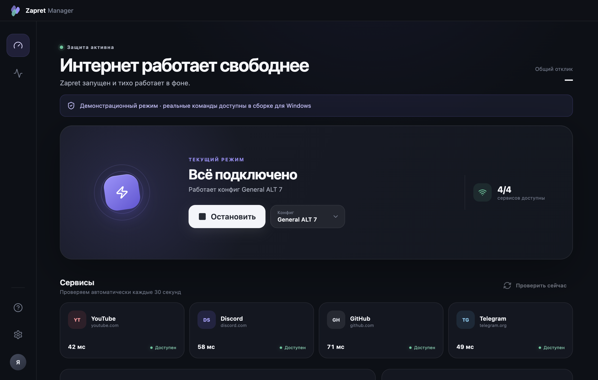

# Zapret Manager

Простой Windows-интерфейс для [Flowseal/zapret-discord-youtube](https://github.com/Flowseal/zapret-discord-youtube). Запускает Zapret, проверяет доступность сервисов и помогает автоматически подобрать рабочую стратегию для текущего провайдера.

> Неофициальный менеджер. Ядро и конфиги загружаются только из официальных релизов Flowseal.

[**Скачать установщик для Windows**](https://github.com/nikitadandev/zapret-manager/releases/latest/download/Zapret-Manager-Setup.exe)



## Как это работает

1. **Запустите менеджер** — он проверит YouTube, Discord, GitHub и Telegram.
2. **Нажмите «Найти лучший конфиг»** — стратегии будут протестированы по очереди.
3. **Пользуйтесь интернетом** — лучший найденный конфиг запустится автоматически.

Для повседневной работы достаточно кнопки включения. Ручной выбор стратегии и дополнительные параметры остаются доступны, но не мешают на главном экране.

## Основные возможности

- запуск и остановка Zapret одной кнопкой;
- фоновая проверка доступности сервисов и времени отклика;
- последовательный тест конфигов `general*.bat`;
- автоматический запуск стратегии с лучшим результатом;
- установка и обновление официальной сборки Flowseal;
- отдельная ручная проверка обновлений Flowseal и самого менеджера;
- проверка SHA-256 перед установкой обновления;
- автозапуск вместе с Windows и фоновая диагностика;
- восстановление активной стратегии после обновления.

## Интерфейс

| Автоматический подбор | Простые настройки |
| --- | --- |
|  |  |

## Сборка

Понадобится Windows 10/11 и Node.js 24.

```powershell
git clone https://github.com/nikitadandev/zapret-manager.git
cd zapret-manager
npm ci
npm test
npm run dist:win
```

Готовый установщик появится в папке `release` под именем `Zapret-Manager-Setup.exe`.

Сборку также можно запустить на GitHub: **Actions → Build Windows installer → Run workflow**. Workflow автоматически запускается для тегов `v*` и сохраняет `.exe` в артефактах запуска.

## Разработка

```bash
npm ci
npm run dev
```

На macOS и Linux интерфейс запускается в демонстрационном режиме без выполнения Windows-команд.

## Безопасность

- интерфейс не получает прямой доступ к Node.js;
- архив сверяется с SHA-256 из GitHub Release;
- ядро Zapret не включено в установщик менеджера;
- загрузка выполняется из `Flowseal/zapret-discord-youtube`;
- для WinDivert и `winws.exe` Windows запросит права администратора.
